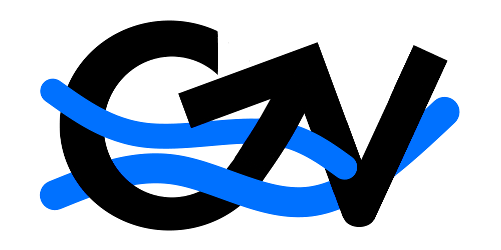

# CV Next


[](https://www.typescriptlang.org/)
[](https://nextjs.org/)
[](https://drive.google.com/)
[](https://supabase.com/)
[](https://aws.amazon.com/amplify/)

A (not so) simple CV upload and peer review system.

## Installation

```
git clone https://github.com/magshimim-next/cv-next.git
npm install
```

then fill in an .env.local config file with the credentials to Supabase(Supabase URL and anon key) that you can get from us in the community chat, and add the base URL(usually localhost for local development) as seen in the [example env file](./cv_next/.env.local.example).

### Local Usage

```
npm run dev
```

## Documentation

A simple web app that will show CV documents hosted on Google Docs and Drive with an option to discuss changes.

Please read the [design document](/docs/DESIGN.md) for more information.

More design documents can be found in the [docs folder](./docs/).

## Feedback and Contributions

> [!NOTE]
> For the near future, we have decided to only allow and accept contributions from Magshimim Next members to contribute to the project.

Please read more [here](./CONTRIBUTING.md).
