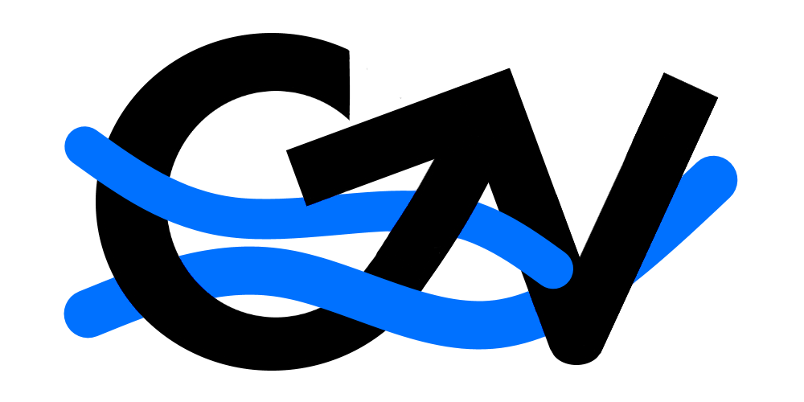

# CV Next


[](#)
[](#)
[](#)
[](#)

[](#)

A (not so) simple CV upload and peer review system.

## Installation

```
git clone https://github.com/magshimim-next/cv-next.git
cd cv_next
npm install
```

then fill in an .env.local config file with the credentials to supabase(supabase url and anon key), and add the base URL(usually localhost for local development) as seen in the [example env file](./cv_next/.env.local.example).

### Local Usage

```
npm run dev
```

## Roadmap

A simple web app that will show cv documents hosted on Google Docs with an option to discuss changes.

Please read the [design document](/docs/DESIGN.md) for more information.
