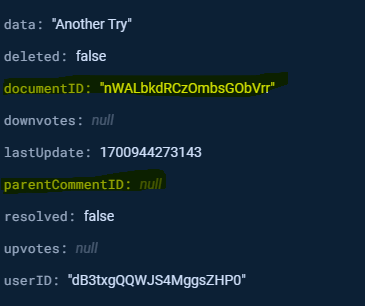
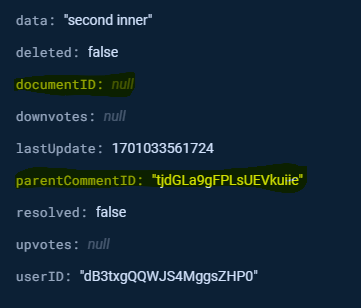

# CV Page SSR Changes

***TO BE DELETED!!*

## What currently happens

**Currently** we load the comments in SSR mode, which means that for each change we make to the comments we need to refetch and reload the entire comments section.
This is a horendous UX because:

1. We don't (and can't!) provide a loading state to show that an action is happening
2. The performance impact is quite significant on big comment sections (not that big! Even 10-20 is enough to be impacted)

ALSO - the current logic (and db data) is built on the concept of child-comments, where each comment is either a root comment, meaning it's directly related to the cv, or a child comment, meaning its relation to the cv is only indirect and through its parent comment.
This is strucutred like this, for example:

* root comment:

* child comment:

**This** means that the way we query the entire comments section is to first fetch all the root comments (because we have the cv id), and then for each comment try to get all its related child comments, in a recursive way.
This is nice for quickly fetching the first top comments, but it's:

1. Terrible for rate-limiting and query-amount
2. Terrible for performance (because multiple queries >> one big query)

## What we need to do

**The solution** has multiple steps:

1. Change the db data structure so that ALL the comments will have the cv id, that way we can load in a single query to a single object all the cvs
2. Change the comments components to not query for child comments each time, but only receive them (either filtered from prop or get the comments from cache and filter in the component itself; talk to me in this stage)
3. Encapsulate the comments section with a library like SWR or React-Query, that can handle:
3.1. Automatic refetching (interval or tag based)
3.2. Loading state
3.3. Optimistic UI
3.4. (Good bonus:) Partial update
Both SWR and React-Query should support all of that; SWR is more light-weight and is built by Vercel so should play nice with NextJS, while React-Query is more popular and hence has better support (potentially; though might potentially not play so nice with newer NextJS features)
4. Add loading state using the library from [3] in the up-most component of the comments section, and use the state handle to all the client actions that has CRUD-related actions
5. Try as much as you can to not break the dynamic-SSR. This mostly means that you should try to move as much pure UI down the component tree as you can. For example, for a single comment component you should try to pass the dynamic actions/UI with { children } and statically render the component based purely on props/cached data (e.g. server actions)

I will try to provide as much code as I can from what I have locally, but in its current state it might only be confusing. Anyway, talk to with. This is no small task, but very achievable.
